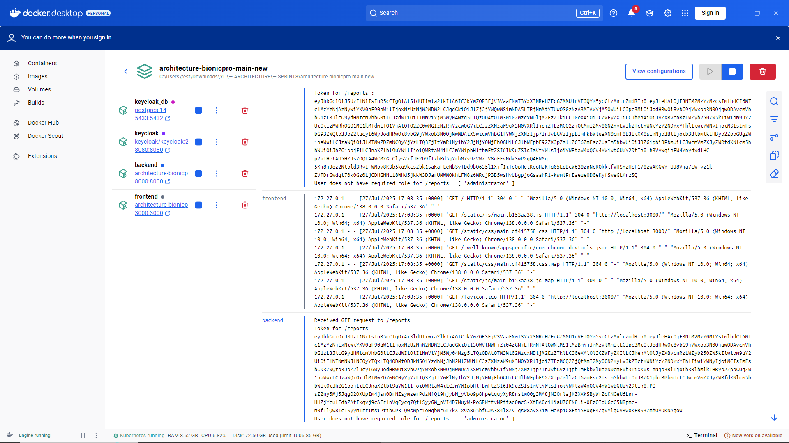
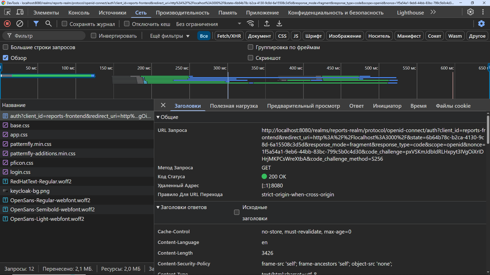
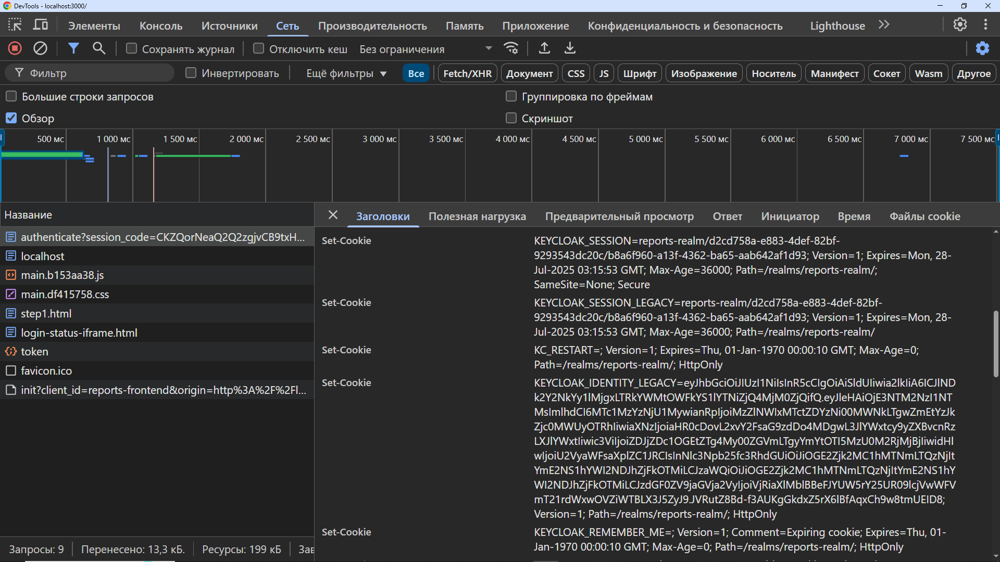
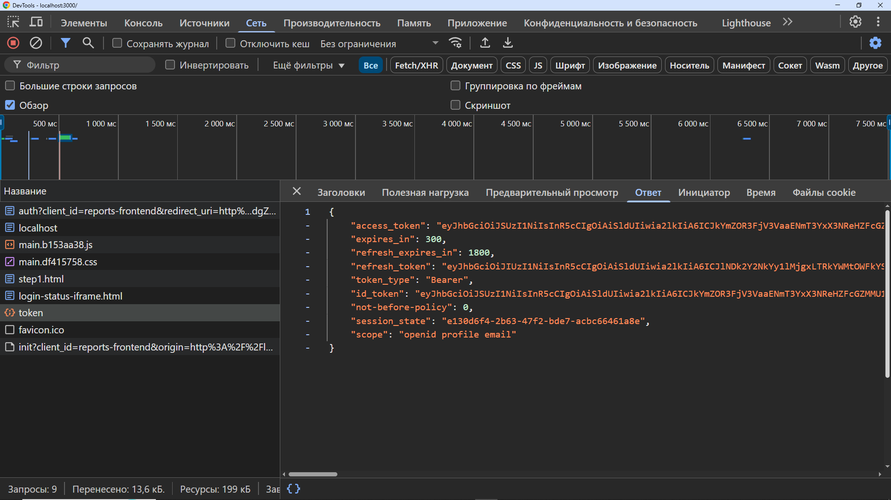
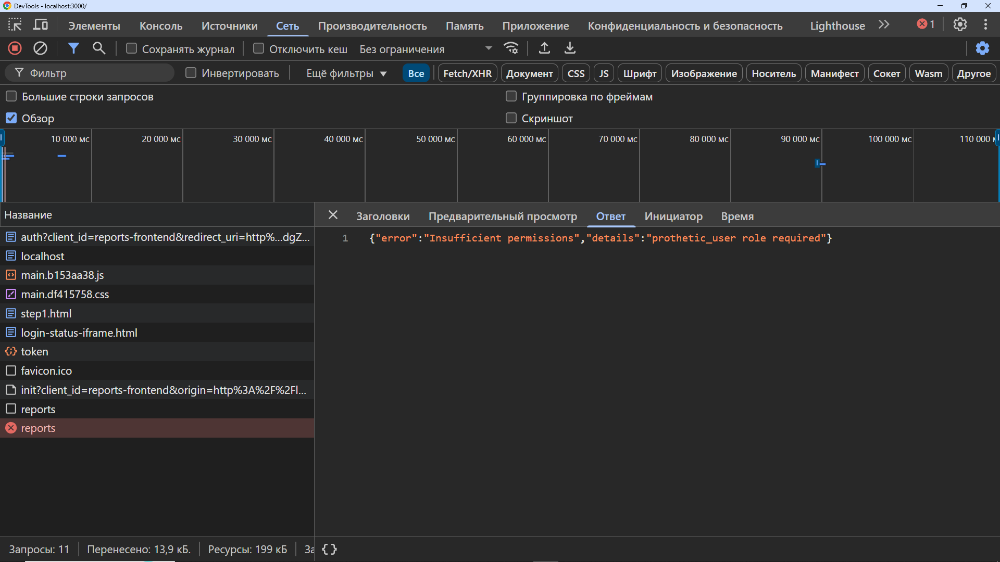
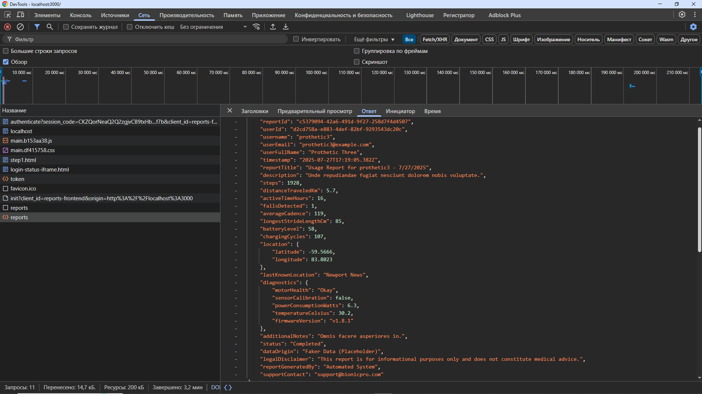

## компания BionicPRO, повышение безопасности (Keycloak PKCE Code Grant), API для генерации отчётов  

### Keycloak PKCE Code Grant: Описание  

**PKCE (Proof Key for Code Exchange)** - это механизм безопасности, добавленный к стандартному OAuth 2.0 Authorization Code Grant, который предназначен для защиты от атак interception code grant. В частности, он решает проблему, когда authorization code может быть перехвачен злоумышленником, особенно в публичных клиентах (например, веб-приложениях, мобильных приложениях), где секрет клиента не может быть надежно сохранен. Keycloak, как IAM (Identity and Access Management) система, полностью поддерживает PKCE.  

**Проблемы, которые решает PKCE:**  

- **Перехват Authorization Code**: В стандартном Authorization Code Grant приложение получает authorization code от сервера авторизации и затем обменивает его на access token. Если этот код перехвачен (например, через вредоносное расширение браузера или атаку Man-in-the-Middle), злоумышленник может использовать его для получения доступа к ресурсам пользователя.  
- **Отсутствие Client Secret**: В публичных клиентах невозможно безопасно хранить Client Secret. Без PKCE приложению пришлось бы полагаться только на redirect URI для защиты, что недостаточно.  

**Как работает PKCE:**  

PKCE добавляет два новых параметра к flow авторизации:  

1. **code_verifier**: Секретная строка, созданная клиентом (приложением) случайным образом. Она должна быть достаточно длинной и непредсказуемой (обычно рекомендуется использовать Base64 URL encoded строку длиной от 43 до 128 символов).  
2. **code_challenge**: Производная от code_verifier. Обычно это SHA256-хеш code_verifier, закодированный в Base64 URL encoding.  

**Схема PKCE flow в Keycloak:**  

1. **Генерация code_verifier и code_challenge:**  

   - Приложение генерирует случайный code_verifier.  
   - Приложение вычисляет code_challenge из code_verifier с использованием SHA256 и Base64 URL encoding. Keycloak также поддерживает параметр code_challenge_method, который указывает, как был получен code_challenge. Поддерживаемые значения:  
     - **S256 (рекомендуется)**: Приложение вычисляет SHA256 хеш.  
     - **plain**: Приложение отправляет code_verifier как есть (не рекомендуется из-за соображений безопасности). Если code_challenge_method не указан, Keycloak предполагает plain.  
  
2. **Запрос авторизации:**  

   - Приложение перенаправляет пользователя на endpoint авторизации Keycloak, передавая следующие параметры:  
     - **response_type=code**: Указывает, что приложение хочет получить authorization code.  
     - **client_id**: Идентификатор клиента в Keycloak.  
     - **redirect_uri**: URI, на который Keycloak перенаправит пользователя после авторизации.  
     - **scope**: Список scope'ов, которые запрашивает приложение (например, openid profile email).  
     - **code_challenge**: Значение, вычисленное на предыдущем шаге.  
     - **code_challenge_method=S256** (или plain, если использовался этот метод).  
     - **state**: (Рекомендуется) Случайно сгенерированный string, который приложение использует для защиты от CSRF-атак. Keycloak возвращает этот параметр обратно в redirect URI, позволяя приложению убедиться, что ответ пришел от Keycloak.  

   **Пример URL запроса авторизации:**  

```
  http://localhost:8080/realms/react-realm/protocol/openid-connect/auth?
  response_type=code&
  client_id=react-client&
  redirect_uri=http://localhost:3000/callback&
  scope=openid profile email&
  code_challenge=E9Melhoa2OwvFrEMTJguMnUEj0KnJmWnEw5tOWc6cU&
  code_challenge_method=S256&
  state=af0ifjsldkj
```

### Запрос авторизации:  

- Приложение перенаправляет пользователя на endpoint авторизации Keycloak, передавая следующие параметры:  
  - **response_type=code**: Указывает, что приложение хочет получить authorization code.  
  - **client_id**: Идентификатор клиента в Keycloak.  
  - **redirect_uri**: URI, на который Keycloak перенаправит пользователя после авторизации.  
  - **scope**: Список scope'ов, которые запрашивает приложение (например, openid profile email).  
  - **code_challenge**: Значение, вычисленное на предыдущем шаге.  
  - **code_challenge_method=S256** (или plain, если использовался этот метод).  
  - **state**: (Рекомендуется) Случайно сгенерированный string, который приложение использует для защиты от CSRF-атак. Keycloak возвращает этот параметр обратно в redirect URI, позволяя приложению убедиться, что ответ пришел от Keycloak.  

**Пример URL запроса авторизации:**  
```
  http://localhost:8080/realms/react-realm/protocol/openid-connect/auth?
  response_type=code&
  client_id=react-client&
  redirect_uri=http://localhost:3000/callback&
  scope=openid profile email&
  code_challenge=E9Melhoa2OwvFrEMTJguMnUEj0KnJmWnEw5tOWc6cU&
  code_challenge_method=S256&
  state=af0ifjsldkj  
```

### 3. Аутентификация пользователя:  

- **Keycloak** отображает страницу входа для пользователя.  
- Пользователь вводит свои учетные данные и проходит аутентификацию.  

### 4. Перенаправление с Authorization Code:  

- После успешной аутентификации, **Keycloak** перенаправляет пользователя обратно на **redirect_uri** с authorization code в качестве параметра запроса, а также возвращает параметр **state**.  

**Пример URL перенаправления:**  

```
  http://localhost:3000/callback?code=AUTHORIZATION_CODE&state=af0ifjsldkj
```

### 5. Обмен Authorization Code на Access Token:  

- Приложение получает **authorization code** из URL.  
- Приложение отправляет **POST-запрос** на **token endpoint** Keycloak, передавая следующие параметры:  
  - **grant_type=authorization_code**: Указывает, что приложение использует authorization code grant.  
  - **client_id**: Идентификатор клиента в Keycloak.  
  - **redirect_uri**: URI, который был использован в запросе авторизации.  
  - **code**: Authorization code, полученный на предыдущем шаге.  
  - **code_verifier**: Исходный, случайный **code_verifier**, сгенерированный на первом шаге. Это критически важно!  

**Пример POST-запроса** (формат application/x-www-form-urlencoded):  

```
  POST /realms/react-realm/protocol/openid-connect/token HTTP/1.1
  Host: localhost:8080
  Content-Type: application/x-www-form-urlencoded

  grant_type=authorization_code&
  client_id=react-client&
  redirect_uri=http://localhost:3000/callback&
  code=AUTHORIZATION_CODE&
  code_verifier=ORIGINAL_CODE_VERIFIER
```

### 6. Получение Access Token:  

- **Keycloak** проверяет **code_verifier** с **code_challenge**, отправленным в запросе авторизации. Если они совпадают (после соответствующей обработки, в зависимости от **code_challenge_method**), **Keycloak** выдает **access token**, **refresh token** и **ID token**.  

**Пример ответа** (JSON):  
```
    {
      "access_token": "ACCESS_TOKEN",
      "expires_in": 300,
      "refresh_token": "REFRESH_TOKEN",
      "refresh_expires_in": 3600,
      "id_token": "ID_TOKEN",
      "token_type": "bearer",
      "not-before-policy": 0,
      "session_state": "SESSION_STATE",
      "scope": "openid profile email"
    }
```

### 7. Использование Access Token:  

- **Приложение** использует **access token** для доступа к защищенным ресурсам (например, к API).  

**Преимущества PKCE:**  

- **Усиленная безопасность для публичных клиентов**: Защита от перехвата **authorization code**. Даже если код будет перехвачен, злоумышленник не сможет обменять его на **access token**, так как у него нет **code_verifier**.  
- **Поддержка в Keycloak**: **Keycloak** полностью поддерживает **PKCE**, что упрощает интеграцию в приложения.  
- **Соответствие стандартам**: **PKCE** является расширением **OAuth 2.0** и рекомендуется для публичных клиентов.  

**Настройка PKCE в Keycloak:**  

1. **Создание клиента**: При создании клиента в **Keycloak** (например, **react-client**), необходимо убедиться, что он настроен как **Public** (Access Type: public). Если это **confidential client**, PKCE не будет применяться, так как подразумевается наличие **client secret**, который можно безопасно хранить.  
2. **Включение Standard Flow**: Проверяем, что опция **"Standard Flow Enabled"** включена для нашего клиента. Это необходимо для использования **authorization code grant**.  
3. **Установка Valid Redirect URIs**: Настраиваем допустимые **redirect URI** для нашего приложения. Это важная мера безопасности, предотвращающая перенаправление на несанкционированные сайты.  

**Ключевые моменты:**  

- **code_verifier** должен быть секретным и известен только приложению.  
- **code_verifier** отправляется только один раз - при обмене **authorization code** на **access token**. Он не передается в запросе авторизации.
- Использование параметра **state** крайне рекомендуется для защиты от **CSRF**.  
- **code_challenge_method=S256** предпочтительнее, чем **plain**.  

### Сборка/запуск проекта  

Выполняем для сборки проекта:  
```
docker compose build
```

Выполняем для запуска проекта:  
```
docker compose up
```

Выполняем для остановки проекта:  
```
docker compose down --volumes
```

### Структура проекта  

```
.\
├── .gitignore                        				# Файл для игнорирования определённых файлов и папок Git'ом
├── docker-compose.yaml               	# Файл конфигурации для Docker Compose, описывающий сервисы
├── README.md                         			# Документация проекта, включающая инструкции по установке и использованию
│   
├── api/                          				# Каталог для бэкенд-приложения
│   ├── Dockerfile                    				# Dockerfile для сборки бэкенда
│   ├── package.json                  			# Зависимости и скрипты для бэкенд-приложения
│   ├── server.js                     				# Главный файл для запуска сервера бэкенда
│   
├── frontend/                         				# Каталог для фронтенд-приложения
│   ├── .env                          				# Файл среды для хранения переменных окружения (например, URL Keycloak)
│   ├── .gitignore                    				# Файл для игнорирования определённых файлов и папок Git'ом
│   ├── Dockerfile                    				# Dockerfile для сборки фронтенда
│   ├── nginx.conf                    			# Конфигурация Nginx для раздачи статических файлов и настройки проксирования
│   ├── package.json                  			# Зависимости и скрипты для фронтенд-приложения
│   ├── package-lock.json             		# Зафиксированные версии зависимостей для фронтенда
│   ├── postcss.config.js             			# Конфигурация PostCSS для обработки CSS
│   ├── public/                       				# Папка для статических файлов, доступных на клиенте
│   │   └── index.html                			# Основной HTML файл
│   ├── src/                          					# Исходный код фронтенд-приложения
│   │   ├── App.tsx                   				# Основной компонент приложения
│   │   ├── components/               		# Папка с переиспользуемыми компонентами React
│   │   │   └── ReportPage.tsx        		# Компонент страницы отчета
│   │   ├── index.css                 				# Основной файл стилей
│   │   ├── index.tsx                 				# Точка входа в приложение React
│   │   └── tailwind.config.js        			# Конфигурация для TailwindCSS
│   │   └── tsconfig.json             			# Конфигурация TypeScript
│
├── images/                              					# Каталог для изображений, используемых в проекте
│   ├── docker-bionicpro.png             			# Изображение для Docker
│   ├── endpoint-auth.png                			# Изображение для аутентификации
│   ├── endpoint-reports-prothetic.png   	# Изображение для отчетов по протезам
│   ├── endpoint-reports-user-admin.png  # Изображение для отчетов администраторов пользователей
│   ├── endpoint-token.png               			# Изображение для токена
│   ├── keycloak-cookies.png             			# Изображение для cookies Keycloak
│
├── keycloak/                         				# Каталог для конфигурации Keycloak
│   └── realm-export.json             		# Экспортированная конфигурация реалма для Keycloak
│
├── node_modules/                     		# Установленные зависимости (необходимо игнорировать в Git)
└── postgres-keycloak-data/           	# Данные PostgreSQL для Keycloak
```

### Изменения и дополнения  

#### 1. Frontend  

Добавляем настройку PKCE в `App.tsx`:   

```
// Главный компонент приложения
const App: React.FC = () => {
  return (
    <ReactKeycloakProvider
      authClient={keycloak} // Передаем клиент Keycloak в провайдер
      initOptions={{
        onLoad: 'login-required', // Указываем, что пользователь должен быть залогинен для доступа к приложению
        pkceMethod: 'S256', // Включаем PKCE (Proof Key for Code Exchange) с методом S256 для повышения безопасности
      }}
    >
      <div className="App">
        <ReportPage /> {/* Рендерим компонент страницы отчета */}
      </div>
    </ReactKeycloakProvider>
  );
};
```
#### 2. API (backend)  

2.1 Верификация token-а авторизации и проверка роли:  
```
// Функция для верификации токена
const verifyToken = (req, res, next) => {
  const authHeader = req.headers['authorization']; // Извлекаем заголовок авторизации из запроса
  if (!authHeader) {
    console.log('No Authorization header provided for', req.url); // Логируем отсутствие заголовка авторизации
    return res.status(401).json({ error: 'No token provided' }); // Возвращаем 401, если токен отсутствует
  }

  const token = authHeader.split(' ')[1]; // Извлекаем токен из заголовка авторизации
  if (!token) {
    console.log('Invalid token format for', req.url); // Логируем неправильный формат токена
    return res.status(401).json({ error: 'Invalid token format' }); // Возвращаем 401, если формат токена неверный
  }

  console.log('Token for', req.url, ':', token); // Логируем токен

  // Верифицируем токен
  jwt.verify(token, getKey, {
    issuer: `${issuerUrl}/realms/${keycloakRealm}`, // Указываем URL издателя токена
    algorithms: ['RS256'], // Алгоритм подписи токена
  }, (err, decoded) => { // Обрабатываем результат проверки токена
    if (err) {
      console.error('Token verification failed for', req.url, ':', err.message); // Логируем ошибку верификации
      return res.status(401).json({ error: 'Token verification failed', details: err.message }); // Возвращаем 401 при ошибке
    }

    // Если токен успешно проверен, сохраняем декодированные данные пользователя в req.user
    req.user = decoded; // Сохраняем декодированные данные о пользователе
    next(); // Переходим к следующему middleware
  });
};

// Функция для проверки роли
const checkRole = (req, res, next) => {
  // Проверяем наличие роли prothetic_user у пользователя
  if (!req.user.realm_access?.roles.includes('prothetic_user')) {
    console.log('User does not have required role for', req.url, ':', req.user.realm_access?.roles); // Логируем отсутствие роли
    return res.status(403).json({ error: 'Insufficient permissions', details: 'prothetic_user role required' }); // Возвращаем 403, если роль отсутствует
  }

  console.log('User has required role for', req.url); // Логируем, что у пользователя есть необходимая роль
  next(); // Переходим к следующему middleware
};
```

2.2 Endpoint генерации отчётов с предварительной верификацией token-а авторизации и проверкой роли:  

```
// Эндпоинт /reports с генерацией отчета для конкретного пользователя
app.get('/reports', verifyToken, checkRole, async (req, res) => {
  const user = req.user; // Извлекаем информацию о пользователе из запроса
  const userId = user.sub; // Получаем уникальный ID пользователя из токена

  // TODO: Заменить на реальные данные из ClickHouse и CRM
  const reportData = {
    reportId: faker.datatype.uuid(), // Генерируем случайный UUID для идентификации отчета
    userId: userId, // ID пользователя, для которого создается отчет
    username: user.preferred_username, // Имя пользователя, полученное из токена
    userEmail: user.email || 'N/A', // Email пользователя, если имеется, иначе 'N/A'
    userFullName: `${user.given_name || ''} ${user.family_name || ''}`.trim() || 'N/A', // Полное имя пользователя

    timestamp: new Date().toISOString(), // Временная метка отчета в формате ISO
    reportTitle: `Usage Report for ${user.preferred_username} - ${new Date().toLocaleDateString()}`, // Заголовок отчета с именем пользователя и текущей датой
    description: faker.lorem.sentence(), // Случайное описание отчета, сгенерированное с помощью Faker

    // Данные об использовании протеза
    steps: faker.datatype.number({ min: 1000, max: 10000 }), // Случайное количество шагов, которые пользователь сделал
    distanceTraveledKm: faker.datatype.float({ min: 0.5, max: 10, precision: 0.1 }), // Случайное расстояние, которое пользователь прошел в км
    activeTimeHours: faker.datatype.float({ min: 6, max: 18, precision: 0.5 }), // Случайное количество часов активного времени
    fallsDetected: faker.datatype.number({ min: 0, max: 3 }), // Количество падений, зафиксированных пользователем
    averageCadence: faker.datatype.number({ min: 60, max: 120 }), // Средняя частота шагов
    longestStrideLengthCm: faker.datatype.float({ min: 50, max: 100, precision: 1 }), // Длина самого длинного шага в сантиметрах
    batteryLevel: faker.datatype.number({ min: 20, max: 100 }), // Уровень заряда батареи устройства
    chargingCycles: faker.datatype.number({ min: 0, max: 500 }), // Количество циклов зарядки устройства

    // Данные о местоположении
    location: {
      latitude: Number(faker.address.latitude()), // Случайная широта
      longitude: Number(faker.address.longitude()), // Случайная долгота
    },
    lastKnownLocation: faker.address.city(), // Случайный город в качестве последнего известного местоположения

    // Диагностические данные
    diagnostics: {
      motorHealth: faker.helpers.arrayElement(['Good', 'Okay', 'Needs Service']), // Состояние мотора сгенерированное с помощью Faker
      sensorCalibration: faker.datatype.boolean(), // Состояние калибровки сенсоров (истина/ложь)
      powerConsumptionWatts: faker.datatype.float({ min: 5, max: 20, precision: 0.1 }), // Потребление энергии в ваттах
      temperatureCelsius: faker.datatype.float({ min: 25, max: 40, precision: 0.1 }), // Температура устройства в градусах Цельсия
      firmwareVersion: `v${faker.datatype.number({ min: 1, max: 5 })}.${faker.datatype.number({ min: 0, max: 9 })}.${faker.datatype.number({ min: 0, max: 9 })}`, // Версия прошивки
    },

    // Дополнительная информация
    additionalNotes: faker.lorem.sentence(), // Случайные дополнительные заметки о пользователе или устройстве
    status: faker.helpers.arrayElement(['Completed', 'In Progress', 'Pending']), // Случайный статус отчета
    dataOrigin: 'Faker Data (Placeholder)', // Указываем, что данные сгенерированы с помощью Faker

    legalDisclaimer: 'This report is for informational purposes only and does not constitute medical advice.', // Юридический отказ от ответственности
    reportGeneratedBy: 'Automated System', // Указываем, что отчет сгенерирован автоматически
    supportContact: 'support@bionicpro.com', // Контактная информация для поддержки
  };

  // TODO: Заменить на реальные данные из ClickHouse и CRM и добавить фильтрацию по userId
  res.json(reportData); // Отправляем сгенерированные данные отчета в формате JSON
});
```

### Проверка работоспособности  

Для пользователей `user`, `admin`:  
```
GET http://localhost:8000/reports
```
Вывод:  
```
{"error":"Insufficient permissions","details":"prothetic_user role required"}
```

Для пользователей `prothetic`:  
```
GET http://localhost:8000/reports
```
Вывод:  
```
{
    "reportId": "c5379094-42a6-491d-9f27-258d7f4d4507",
    "userId": "d2cd758a-e883-4def-82bf-9293543dc20c",
    "username": "prothetic3",
    "userEmail": "prothetic3@example.com",
    "userFullName": "Prothetic Three",
    "timestamp": "2025-07-27T17:19:05.382Z",
    "reportTitle": "Usage Report for prothetic3 - 7/27/2025",
    "description": "Unde repudiandae fugiat nesciunt dolorem nobis voluptate.",
    "steps": 1928,
    "distanceTraveledKm": 5.7,
    "activeTimeHours": 16,
    "fallsDetected": 1,
    "averageCadence": 119,
    "longestStrideLengthCm": 85,
    "batteryLevel": 58,
    "chargingCycles": 107,
    "location": {
        "latitude": -59.5666,
        "longitude": 83.8023
    },
    "lastKnownLocation": "Newport News",
    "diagnostics": {
        "motorHealth": "Okay",
        "sensorCalibration": false,
        "powerConsumptionWatts": 6.3,
        "temperatureCelsius": 30.2,
        "firmwareVersion": "v1.8.1"
    },
    "additionalNotes": "Omnis facere asperiores in.",
    "status": "Completed",
    "dataOrigin": "Faker Data (Placeholder)",
    "legalDisclaimer": "This report is for informational purposes only and does not constitute medical advice.",
    "reportGeneratedBy": "Automated System",
    "supportContact": "support@bionicpro.com"
}
```

### Журналирование, browser developer-tools, screenshot-ы  

  

  

  

  

  

  

### Заключение:  

PKCE - это важный механизм безопасности, который должен использоваться в публичных OAuth 2.0 клиентах для защиты от атак перехвата authorization code. Keycloak предоставляет отличную поддержку PKCE, что упрощает его интеграцию в ваши приложения. Следуя описанным выше шагам, вы можете обеспечить безопасную аутентификацию и авторизацию пользователей в ваших приложениях, используя Keycloak и PKCE.  